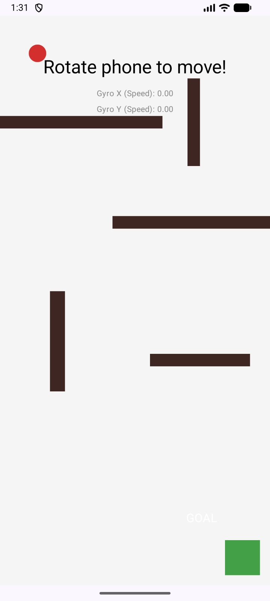

# CS501_Individual Assignment 4
# Q1 - Gyroscope Controlled Ball Game

## Description

This project is a simple Android game where a ball moves on the screen based on the phone’s tilt using the gyroscope sensor. The user controls the ball and navigates it through obstacles to reach the goal area.

---

## Features

* Uses gyroscope sensor to detect phone tilt
* Ball movement based on tilt direction
* Smooth movement using velocity and friction
* Maze-like obstacles on the screen
* Collision detection with walls and boundaries
* Goal area to complete the game
* Restart option after winning
* Debug values to verify gyroscope working

---

## Technologies Used

* Kotlin
* Jetpack Compose
* Android Sensor API (Gyroscope)
* Canvas for drawing UI

---

## How the Game Works

* The gyroscope detects the phone’s rotation
* Sensor values are used to update ball velocity
* Tilting the phone moves the ball in different directions
* Friction slows the ball gradually
* The ball collides with walls and obstacles
* The goal is to move the ball into the goal area

---

## Game Logic

### Sensor Handling

The gyroscope sensor (TYPE_GYROSCOPE) is used to capture rotation values. These values are used to update velocity of the ball.

### Physics

Velocity is updated continuously and applied to position. Friction is applied to reduce speed over time.

### Collision Detection

The ball checks collision with screen boundaries and obstacles using rectangle overlap logic. On collision, velocity is reversed.

### Win Condition

If the ball reaches the goal area, the game displays a win message and allows restart.

---

## Assignment Requirements Covered

* Use gyroscope to detect phone tilt
* Move a ball based on tilt direction
* Add walls and obstacles
* Implement simple game logic

---

## Screenshot

---

## How to Run

1. Open the project in Android Studio
2. Run the app on a real device
3. Tilt the phone to move the ball
4. Reach the goal area

---

## AI Usage Note

ChatGPT was used as a supporting tool for guidance, understanding concepts, structuring the solution, and fixing minor code errors. The overall implementation, logic, and final code were written and developed by me.

---

## Conclusion

This project demonstrates the use of device sensors in Android to create an interactive game. It combines sensor input, physics simulation, and UI rendering using Jetpack Compose.

---
